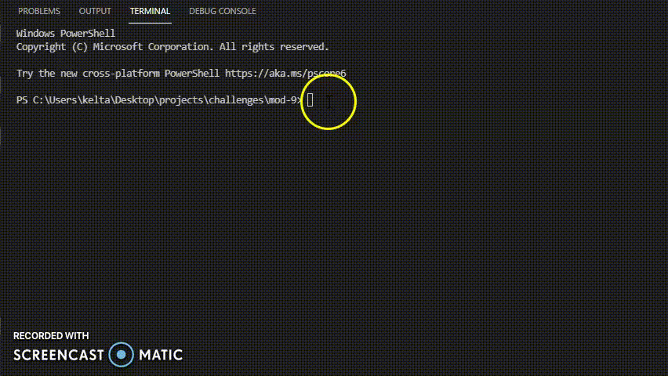

# README.md Generator

## readme-generator on Github

## Description

A CLI, user-input defined, custom README generator.

## Table of Contents

- [Installation Instructions](#installation)
- [Usage Information](#usage)
- [License](#license)
- [Contribution Guidelines](#contributing)
- [Test Instructions](#testing)
- [Questions?](#questions?)

## Installation

To create your README, clone this repository to your local computer.  
This program requires [Node.js](https://nodejs.org/en/) and [Inquirer NPM](https://www.npmjs.com/package/inquirer), which can be installed using [node.js Package Manager](https://www.npmjs.com/).
Install the above, then use your CLI (command-line-interface) to run:

> npm init  
> npm install inquirer

Run the README.md generator by executing node index from the command line.

Find your custom README in the /dist folder. It will contain badges courtesy of shields.io and license text from opensource.org.

## Usage

As shown in the above gif, users are prompted to answer a series of questions. These responses will be applied to the final, custom README.md. Please view the [complete Walkthrough Video](./walkthrough.mp4) here.

Screenshot of user inputting data in CLI.

Screenshot of end product README.

## License

This project was created using ISC license.

## Contributing

This is an open source project.

## Testing

To test the program, please follow above Installation guide.

## Questions?

This program was created by [ru3ykat on GitHub](https://github.com/RU3YKat).

Contact me at [ru3ykat on Gmail](ru3ykat@gmail.com).
